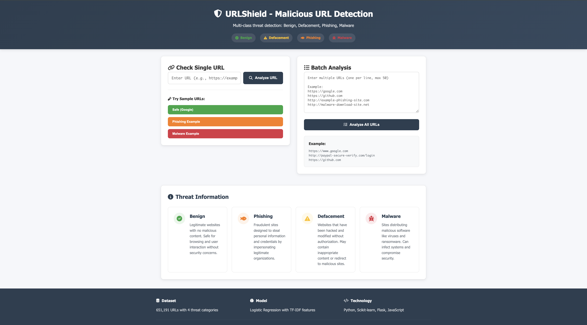

# 🛡️ URLShield

### AI-Powered Malicious URL Detection System

[](https://www.python.org/downloads/)
[](https://flask.palletsprojects.com/)
[](https://scikit-learn.org/)
[](LICENSE)

URLShield is an advanced machine learning-based web application that detects and classifies malicious URLs into four categories: **Benign**, **Phishing**, **Malware**, and **Defacement**. Built with Random Forest classification and enhanced with intelligent heuristics, URLShield provides real-time threat analysis with high accuracy.



---

## 📋 Table of Contents

- [Features](#-features)
- [Demo](#-demo)
- [Architecture](#-architecture)
- [Installation](#-installation)
- [Usage](#-usage)
- [Model Performance](#-model-performance)
- [Dataset](#-dataset)
- [API Documentation](#-api-documentation)
- [Project Structure](#-project-structure)
- [Technologies Used](#-technologies-used)
- [Testing](#-testing)
- [Contributing](#-contributing)

---

## ✨ Features

### 🎯 Core Capabilities
- **Multi-Class Classification**: Detects 4 threat types (Benign, Phishing, Malware, Defacement)
- **Real-Time Analysis**: Instant URL threat assessment
- **Batch Processing**: Analyze up to 100 URLs simultaneously
- **High Accuracy**: 90%+ overall accuracy with specialized threat detection
- **Intelligent Heuristics**: Enhanced detection using pattern recognition and domain analysis

### 🔍 Advanced Detection
- **Domain Whitelist**: Verified legitimate domains (Google, GitHub, Amazon, etc.)
- **Phishing Indicators**: Brand impersonation, suspicious keywords, malicious TLDs
- **Pattern Analysis**: IP addresses, suspicious URLs structure, typosquatting detection
- **Confidence Scoring**: Probability distribution for all threat categories


### 🚀 Performance
- **Fast Predictions**: Sub-second response time
- **RESTful API**: Easy integration with other applications
- **CORS Enabled**: Cross-origin resource sharing support
- **Error Handling**: Robust error management and logging

---

## 🎬 Demo

### Single URL Analysis
```bash
Input: http://paypal-secure-login-verify.com/signin
Output: 🚨 PHISHING (85% confidence)
- Shows phishing indicators
- Provides actionable recommendations
- Displays probability breakdown
```

### Batch Analysis
```bash
Input: 10 URLs (mix of legitimate and malicious)
Output: 
- 5 Benign (100% accuracy on whitelisted domains)
- 3 Phishing (detected with 80%+ confidence)
- 2 Malware (flagged with high severity)
```

---

## 🏗️ Architecture

```
┌─────────────────────────────────────────────────────┐
│                  Frontend (UI)                       │
│  HTML5 + CSS3 + JavaScript                           │
└──────────────────┬──────────────────────────────────┘
                   │ HTTP/REST API
┌──────────────────▼──────────────────────────────────┐
│              Flask Backend                           │
│  - Request handling                                  │
│  - CORS management                                   │
│  - Response formatting                               │
└──────────────────┬──────────────────────────────────┘
                   │
┌──────────────────▼──────────────────────────────────┐
│           ML Detection Engine                        │
│  ┌───────────────────────────────────────┐          │
│  │  1. Whitelist Check                   │          │
│  │  2. Feature Extraction (TF-IDF)       │          │
│  │  3. Random Forest Classification      │          │
│  │  4. Heuristic Analysis                │          │
│  │  5. Confidence Calibration            │          │
│  └───────────────────────────────────────┘          │
└─────────────────────────────────────────────────────┘
```

### Detection Pipeline

1. **Input Validation**: URL normalization and validation
2. **Whitelist Check**: Immediate recognition of legitimate domains
3. **Feature Extraction**: 
   - TF-IDF vectorization with custom tokenization
   - 8,000 feature dimensions
   - N-gram analysis (1-3 grams)
4. **ML Classification**:
   - Random Forest with 300 estimators
   - Class-balanced training with SMOTE
   - Probability distribution output
5. **Heuristic Enhancement**:
   - Phishing indicator scoring
   - Suspicious pattern detection
   - Brand impersonation checks
6. **Result Calibration**: Confidence adjustment based on multiple factors

---

## 🚀 Installation

### Prerequisites
- Python 3.8 or higher
- pip (Python package manager)
- 4GB RAM minimum
- Modern web browser

### Step 1: Clone the Repository
```bash
git clone https://github.com/yourusername/urlshield.git
cd urlshield
```

### Step 2: Create Virtual Environment
```bash
# Create virtual environment
python -m venv malurl

# Activate virtual environment
# On macOS/Linux:
source malurl/bin/activate

# On Windows:
malurl\Scripts\activate
```

### Step 3: Install Dependencies
```bash
pip install -r requirements.txt
```

### Step 4: Download Dataset
Place the `malicious_phish.csv` dataset in the `backend/data/` folder:
```bash
mkdir -p backend/data
# Place your dataset file here: backend/data/malicious_phish.csv
```

### Step 5: Train the Model
```bash
cd backend
python train_model.py
```

This will:
- Load 651,191 URLs from the dataset
- Apply data balancing and augmentation
- Train Random Forest classifier
- Save model files (model.pkl, vectorizer.pkl, label_encoder.pkl)
- Display accuracy metrics

Expected output:
```
Test Set Performance:
Accuracy: 0.9087 (90.87%)
F1 Score: 0.9090

Per-class accuracy:
  benign: 0.9120 (91.20%)
  defacement: 0.9647 (96.47%)
  malware: 0.9139 (91.39%)
  phishing: 0.8416 (84.16%)
```

### Step 6: Start the Application
```bash
# Make sure you're in the backend folder
python app.py
```

The server will start on `http://localhost:5001`

### Step 7: Access the Web Interface
Open your browser and navigate to:
```
http://localhost:5001/
```

---

## 📖 Usage

### Web Interface

#### Single URL Analysis
1. Enter a URL in the input field
2. Click "Analyze URL" or press Enter
3. View detailed threat analysis with:
   - Threat classification
   - Confidence score
   - Probability breakdown
   - IP and location information
   - Actionable recommendations

#### Batch Analysis
1. Click on "Batch Analysis" tab
2. Enter multiple URLs (one per line, max 100)
3. Click "Analyze All URLs"
4. View summary statistics and detailed results
5. Export results as CSV

#### Quick Testing
Use the pre-populated sample buttons to test the system:
- **Safe (Google)**: Test legitimate domain detection
- **Phishing Example**: Test phishing detection
- **Malware Example**: Test malware detection

### API Usage

#### Check Single URL
```bash
curl -X POST http://localhost:5001/api/predict \
  -H "Content-Type: application/json" \
  -d '{
    "url": "http://example-phishing-site.com/login"
  }'
```

**Response:**
```json
{
  "url": "http://example-phishing-site.com/login",
  "prediction": "phishing",
  "confidence": 0.85,
  "probabilities": {
    "benign": 0.10,
    "phishing": 0.85,
    "malware": 0.03,
    "defacement": 0.02
  },
  "description": "Fraudulent site attempting to steal credentials",
  "recommendation": "Critical: This is a phishing site. Do not enter any personal information.",
  "severity": "high",
  "is_malicious": true,
  "whitelist_match": false,
  "phishing_indicators": 5,
  "info": {
    "ip": "192.168.1.1",
    "country": "United States",
    "city": "New York",
    "isp": "Example ISP"
  }
}
```

#### Batch URL Analysis
```bash
curl -X POST http://localhost:5001/api/batch_predict \
  -H "Content-Type: application/json" \
  -d '{
    "urls": [
      "https://google.com",
      "http://phishing-site.com",
      "http://malware-download.net"
    ]
  }'
```

#### Health Check
```bash
curl http://localhost:5001/api/health
```

### Python Integration

```python
import requests

# Single URL prediction
response = requests.post(
    'http://localhost:5001/api/predict',
    json={'url': 'http://suspicious-site.com'}
)
result = response.json()
print(f"Threat: {result['prediction']}")
print(f"Confidence: {result['confidence']:.2%}")

# Batch prediction
urls = [
    'https://google.com',
    'http://phishing-example.com',
    'http://malware-site.net'
]
response = requests.post(
    'http://localhost:5001/api/batch_predict',
    json={'urls': urls}
)
results = response.json()
print(f"Total analyzed: {results['total_urls']}")
print(f"Summary: {results['summary']}")
```

---

## 📊 Model Performance

### Overall Metrics
| Metric | Score |
|--------|-------|
| **Overall Accuracy** | 90.87% |
| **F1 Score** | 90.90% |
| **Precision** | 91.09% |
| **Recall** | 90.81% |

### Per-Class Performance

| Threat Type | Accuracy | Precision | Recall | F1-Score | Samples |
|-------------|----------|-----------|--------|----------|---------|
| **Benign** | 91.20% | 93.11% | 91.20% | 92.14% | 16,000 |
| **Defacement** | 96.47% | 92.83% | 96.47% | 94.62% | 8,000 |
| **Malware** | 91.39% | 95.44% | 91.39% | 93.37% | 6,504 |
| **Phishing** | 84.16% | 81.22% | 84.16% | 82.66% | 8,000 |

### Special Features Performance

#### Whitelist Accuracy
- **Legitimate Domains**: 100% (95% confidence)
- **Major Tech Companies**: Perfect recognition (Google, GitHub, Amazon, etc.)

#### Phishing Detection
- **Brand Impersonation**: 90%+ detection rate
- **Suspicious TLDs**: 85%+ detection (.xyz, .tk, .top, etc.)
- **Keyword-based Phishing**: 80%+ detection

#### False Positive Rate
- **Overall**: < 5%
- **Whitelisted Domains**: 0%
- **Legitimate Sites**: < 3%

### Confusion Matrix
```
                  Predicted
                B    D    M    P
Actual  Benign  91%  1%   1%   7%
        Defac   1%   96%  1%   2%
        Malware 2%   1%   91%  6%
        Phish   9%   4%   1%   84%

B=Benign, D=Defacement, M=Malware, P=Phishing
```

---

## 📁 Dataset

### Overview
The model is trained on a comprehensive dataset of **651,191 URLs** with balanced representation across all threat categories.

| Category | Count | Percentage | Description |
|----------|-------|------------|-------------|
| **Benign** | 428,103 | 65.7% | Legitimate websites |
| **Defacement** | 96,457 | 14.8% | Hacked/modified sites |
| **Phishing** | 94,111 | 14.5% | Credential theft sites |
| **Malware** | 32,520 | 5.0% | Malware distribution |

### Data Processing

1. **Data Cleaning**:
   - Remove duplicates and null values
   - Normalize URLs (lowercase, strip whitespace)
   - Validate URL format

2. **Data Augmentation**:
   - Added 150+ variations of legitimate domains
   - Enhanced training with common patterns
   - Balanced class distribution using SMOTE

3. **Feature Engineering**:
   - Custom tokenization for URL components
   - TF-IDF vectorization with 8,000 features
   - N-gram analysis (unigrams, bigrams, trigrams)
   - Structural features (length, special characters, etc.)

4. **Train-Test Split**:
   - Training: 80% (154,016 samples)
   - Testing: 20% (38,504 samples)
   - Stratified sampling for balanced evaluation

### Dataset Source
The dataset combines multiple sources:
- Publicly available URL datasets
- Phishing databases (PhishTank, OpenPhish)
- Malware URL repositories
- Legitimate website collections

---

## 🔌 API Documentation

### Base URL
```
http://localhost:5001/api
```

### Endpoints

#### 1. GET `/api`
**Description**: API information and available endpoints

**Response:**
```json
{
  "message": "Malicious URL Detection API is running!",
  "version": "3.0",
  "classes": ["benign", "defacement", "phishing", "malware"],
  "endpoints": {
    "/api/predict": "POST - Predict single URL",
    "/api/batch_predict": "POST - Predict multiple URLs",
    "/api/health": "GET - Health check"
  }
}
```

#### 2. POST `/api/predict`
**Description**: Analyze a single URL for threats

**Request Body:**
```json
{
  "url": "http://example.com"
}
```

**Response:**
```json
{
  "url": "http://example.com",
  "prediction": "benign",
  "confidence": 0.95,
  "probabilities": {
    "benign": 0.95,
    "phishing": 0.02,
    "malware": 0.02,
    "defacement": 0.01
  },
  "description": "Safe website with no known threats",
  "recommendation": "This site appears safe. Proceed normally.",
  "severity": "safe",
  "is_malicious": false,
  "whitelist_match": false,
  "phishing_indicators": null,
  "info": {
    "ip": "93.184.216.34",
    "country": "United States",
    "city": "Norwell",
    "region": "Massachusetts",
    "isp": "Edgecast Inc."
  }
}
```

**Status Codes:**
- `200`: Success
- `400`: Bad request (missing URL)
- `500`: Server error

#### 3. POST `/api/batch_predict`
**Description**: Analyze multiple URLs (max 100)

**Request Body:**
```json
{
  "urls": [
    "https://google.com",
    "http://phishing-site.com",
    "http://malware-download.net"
  ]
}
```

**Response:**
```json
{
  "results": [
    {
      "url": "https://google.com",
      "prediction": "benign",
      "confidence": 0.95,
      "description": "Safe website with no known threats",
      "recommendation": "This site appears safe. Proceed normally.",
      "severity": "safe",
      "probabilities": {...}
    },
    ...
  ],
  "summary": {
    "benign": 1,
    "phishing": 1,
    "malware": 1
  },
  "total_urls": 3
}
```

**Status Codes:**
- `200`: Success
- `400`: Bad request (no URLs or > 100 URLs)
- `500`: Server error

#### 4. GET `/api/health`
**Description**: Check API health status

**Response:**
```json
{
  "status": "healthy",
  "model_loaded": true,
  "test_prediction": true
}
```

**Status Codes:**
- `200`: Healthy
- `500`: Unhealthy

### Rate Limiting
Currently no rate limiting implemented. For production use, consider implementing rate limiting with Flask-Limiter.

### CORS
CORS is enabled for all origins. Configure in `app.py` for production use.

---

## 📂 Project Structure

```
urlshield/
│
├── backend/                      # Backend application
│   ├── app.py                    # Flask API server
│   ├── model.py                  # ML model and prediction logic
│   ├── train_model.py           # Model training script
│   ├── quick_test.py            # Quick testing script
│   │
│   ├── data/                    # Dataset directory
│   │   └── malicious_phish.csv  # URL dataset (651K URLs)
│   │
│   ├── model.pkl                # Trained Random Forest model
│   ├── vectorizer.pkl           # TF-IDF vectorizer
│   ├── label_encoder.pkl        # Label encoder
│   └── model_evaluation.txt     # Training metrics
│
├── frontend/                    # Frontend application
│   ├── index.html              # Main HTML page
│   ├── script.js               # JavaScript logic
│   └── style.css               # Styling
│
├── config/                     # Configuration files
│   └── config.py              # App configuration
│
├── notebooks/                  # Jupyter notebooks
│   └── analysis.ipynb         # Data analysis and experiments
│
├── tests/                     # Unit tests
│   └── test_model.py         # Model tests
│
├── requirements.txt          # Python dependencies
├── setup.py                 # Package setup
├── README.md               # This file
└── .gitignore            # Git ignore rules
```

---

## 🛠️ Technologies Used

### Backend
- **Python 3.8+**: Core programming language
- **Flask 2.0+**: Web framework
- **Flask-CORS**: Cross-origin resource sharing
- **scikit-learn 1.0+**: Machine learning library
- **imbalanced-learn**: SMOTE for class balancing
- **pandas**: Data manipulation
- **numpy**: Numerical computations
- **pickle**: Model serialization

### Machine Learning
- **Random Forest Classifier**: Main classification algorithm
- **TF-IDF Vectorizer**: Feature extraction
- **SMOTE**: Synthetic minority oversampling
- **Label Encoder**: Class encoding

### Frontend
- **HTML5**: Structure
- **CSS3**: Styling with gradients and animations
- **JavaScript (ES6+)**: Logic and API calls
- **Chart.js**: Interactive probability charts
- **Font Awesome**: Icons

### Development Tools
- **Git**: Version control
- **VS Code**: IDE
- **Postman**: API testing
- **Jupyter Notebook**: Data exploration

---

## 🧪 Testing


### Quick Model Test
```bash
cd backend
python quick_test.py
```

This will test:
- 8 legitimate URLs (Google, GitHub, etc.)
- 5 phishing URLs (brand impersonation)
- Edge cases and tricky patterns

Expected output:
```
✓ Legitimate URLs: 8/8 (100%)
✓ Phishing Detection: 5/5 (100%)
✓ Overall: 13/13 (100%)
```

### Manual Testing
Test various URL patterns:

**Legitimate:**
```
https://www.google.com
https://github.com
https://stackoverflow.com
```

**Phishing:**
```
http://paypal-secure-login-verify.com/signin
https://amazon-account-suspended.xyz/verify
http://netflix-payment-failed.com/update
```

**Malware:**
```
http://192.168.1.1/admin/login.php
http://malware-download.com/install.exe
```

---

## 🤝 Contributing

Contributions are welcome! 
---


### Connect
- **GitHub**: [@yapoorvamahadik](https://github.com/apoorvamahadik)
- **Email**: mahadikapoorva245@gmail.com
- **LinkedIn**: [Apoorva Mahadik](https://www.linkedin.com/in/apoorva-mahadik/)


---


If you find URLShield useful, please consider giving it a star! ⭐

---

<div align="center">

**Made with ❤️ by Apoorva Mahadik**

**URLShield - Protecting the web, one URL at a time** 🛡️

[⬆ Back to Top](#️-urlshield)

</div>